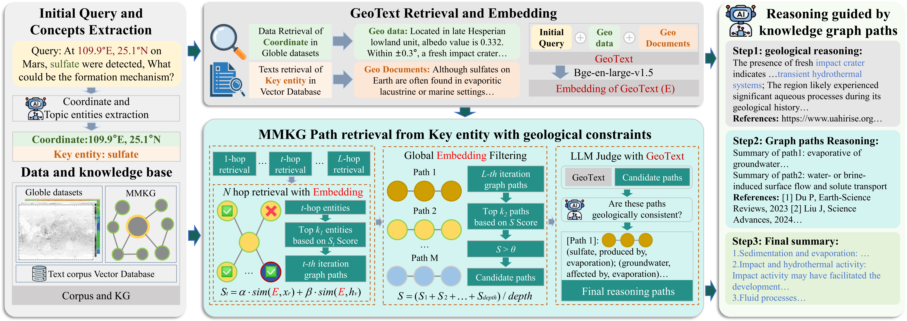
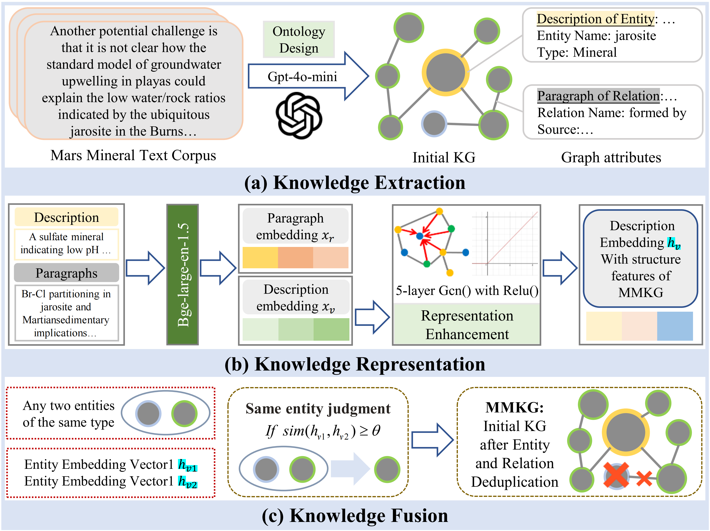

# MMQA: Mars Mineral Question Answering

<p align="center">
  
</p>

MMQA is a Mars mineral question answering system for interpretable geological reasoning. It combines a Martian Mineral Knowledge Graph (MMKG), multi-source geological datasets, a Mars mineral text corpus, and large language models to answer factual, reasoning, and mineral-formation questions.

The accepted version of MMQA focuses on reasoning guided by knowledge graph paths. Given a user query, the system extracts key entities and coordinates, retrieves local geological context and relevant literature evidence, searches graph paths under geological constraints, and generates a traceable answer with supporting reasoning paths and references.

## Data and Knowledge Graph

MMQA is built around two complementary data resources:

- **M200**: a curated bibliography of 200 mineral-formation-related papers. The source list is provided in [`geodata/MM200.csv`](./geodata/MM200.csv).
- **M2000**: a larger Mars mineral text corpus containing 2,000+ papers and reports collected for retrieval, evidence grounding, and corpus-scale knowledge extraction.

From these resources, we construct the **Martian Mineral Knowledge Graph (MMKG)**. The graph stores mineral entities, geological environments, formation processes, relations, descriptions, and provenance evidence. The extraction and fusion workflow is summarized below.

<p align="center">
  
</p>

The MMQA corpus also integrates multi-source geological data, including raster maps, vector maps, tabular geomorphological records, and text evidence. These data provide the local geological context used during formation analysis.

## Data Sources

| Data type | Data | Spatial resolution / content | Format |
| --- | --- | --- | --- |
| Physical property | OMEGA NIR Albedo | 14400 x 7200 pixels (1.48 km/px) | Raster map |
| Physical property | TES Thermal Inertia | 7200 x 3600 pixels (3 km/px) | Raster map |
| Physical property | MOLA Terrain Elevation | 200 m/px | Raster map |
| Chemical property | TES Mineral Maps | 1440 x 720 pixels (16 km/px) | Raster map |
| Chemical property | Elemental Abundance | 72 x 36 pixels (300 km/px) | Raster map |
| Geological age | Geologic Map | Global distribution of geological eras | Vector map |
| Geomorphological feature | Paleolake Basins | Distribution of 425 paleolake basins | Tabular |
| Geomorphological feature | Fluvial Systems | Distribution of 3,772 valley systems | Vector map |
| Geomorphological feature | Craters > 1 km | Distribution of 384,343 craters | Tabular |
| Geomorphological feature | HiRISE Topography | 96,365 coordinate-topography pairs | Tabular |
| Text corpus | Multi-source texts | 214 research articles and 15 NASA reports | Text |

Main public sources include:

- [ASU Mars Data Portal](https://mars.asu.edu/data/) for mineral abundance and thermal inertia.
- [ESA Planetary Science Archive](https://www.cosmos.esa.int/web/psa/mars-maps) for surface albedo.
- [USGS SIM 3292 Mars Global Geologic GIS Database](https://pubs.usgs.gov/sim/3292/) for global geologic units.
- [USGS MOLA-HRSC Blended DEM](https://astrogeology.usgs.gov/search/map/mars_mgs_mola_mex_hrsc_blended_dem_global_200m) for terrain elevation.
- [University of Arizona HiRISE Archive](https://www.uahirise.org/anazitisi.php) for HiRISE imagery and topographic context.
- [Robbins Crater Database](https://craters.sjrdesign.net/) for crater records.
- [UT Austin Goudge Lab Shared Data](https://www.jsg.utexas.edu/goudge/shared-data/) for paleolake basins.
- [Global Valley Network Database](https://agupubs.onlinelibrary.wiley.com/doi/10.1029/2018EA000362) for valley systems.

## Code Structure

The code is organized around a compact reasoning pipeline:

- [`MMAgentV2.py`](./MMAgentV2.py): main MMQA pipeline for intent recognition, geological context retrieval, graph/text retrieval, and answer generation.
- [`MMQAsimple.py`](./MMQAsimple.py): lightweight formation-analysis demo using only geological context, without MMKG or text-corpus retrieval.
- [`graph_query.py`](./graph_query.py): knowledge graph path retrieval and provenance handling.
- [`retrieval_with_context_v2.py`](./retrieval_with_context_v2.py), [`text_retrival.py`](./text_retrival.py): text and context retrieval.
- [`path_selector.py`](./path_selector.py), [`link_scorer.py`](./link_scorer.py), [`embedding_utils.py`](./embedding_utils.py): embedding-based path scoring and representation utilities.
- [`geo_context_loader.py`](./geo_context_loader.py), [`geo_context_summary.py`](./geo_context_summary.py): loading and summarizing multi-source geological data.
- [`intent_classifier.py`](./intent_classifier.py), [`answer_generator.py`](./answer_generator.py), [`prompt.py`](./prompt.py): intent detection, prompt templates, and final response generation.
- [`proxy_config.py`](./proxy_config.py): API key and OpenAI-compatible endpoint configuration.

## Quick Start

1. Install the required Python packages for LLM access, embedding retrieval, geospatial processing, and local data loading.

2. Configure API access in [`proxy_config.py`](./proxy_config.py):

```python
API_KEY = "your_api_key"
BASE_URL = "your_base_url"
```

3. Place the required MMKG, text corpus, embedding indexes, and geological datasets in the expected local paths. The included [`geodata`](./geodata) directory can be used as the starting location for geological data.

4. Run the full MMQA pipeline:

```bash
python MMAgentV2.py
```

5. For a minimal demonstration without the knowledge graph and text corpus, run:

```bash
python MMQAsimple.py
```

Example query:

```text
At 109.9 degrees E, 25.1 degrees N on Mars, sulfate was detected. What could be the formation mechanism?
```

The full system returns an answer grounded in geological context, retrieved text evidence, and MMKG reasoning paths. The simplified version is useful for testing coordinate-based geological reasoning when the complete MMKG and corpus resources are not available.
